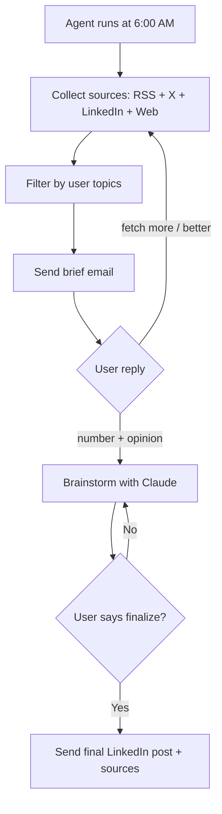

# content-Agent

Agentic content curation system — multi-source ingestion, AI ranking, email delivery, brainstorm loop, LinkedIn post generation.

Runs at 6am daily. Pulls from RSS feeds, X, LinkedIn, and web search. Filters by topic. Sends a 10-item brief by email. You reply with a number and a take — the agent brainstorms with you, pushes back on vague claims, and when you're ready, drafts a post and sends it to your inbox.

Built from the actual workflow I use to stay sharp on frontier AI and product leadership.

---

## What it does

The brief blends:

- Company and product blogs via RSS (AI labs, builders)
- Tech and business press (AI, product, industry)
- Newsletters and long-form analysis
- Public X and LinkedIn discovery via search (not logged-in scraping)
- Targeted web search (configurable in `content_agent_config.json`)

You reply to the email with a number and your raw take. The agent challenges vague claims, asks for specifics, and helps you think clearly. When you say "finalize," a polished post lands in your inbox with sources ready to paste.

---

## Architecture decisions

**Why an agent loop instead of a simple script?**

A curation script would just fetch, rank, and send. The value here is in the conversation — the agent needs to hold context across multiple email exchanges, track which article you're discussing, remember constraints you've set ("don't suggest anything from this outlet"), and maintain a coherent brainstorm thread.

The loop architecture means the agent can re-enter a conversation mid-draft, pick up where you left off, and apply everything said in the thread to the next turn. A simple script can't do that.

**Context management strategy**

Each email reply is parsed to extract the referenced item number, the user's position, and any new constraints. The agent reconstructs context from the thread rather than maintaining server-side session state. This makes the system stateless and resilient — if the process restarts, the next email reply picks up cleanly.

Email threads act as the persistent context store. This is intentional: it means the history is human-readable, portable, and not locked in a database.

**Source quality**

Sources are weighted by two signals: recency (newer = more relevant) and reputation (configurable tiers in `content_agent_config.json`). A first-person account from a founder on their company blog ranks higher than a third-party summary of the same event. Primary sources are preferred — transcripts, official posts, primary research — over press coverage.

The agent enforces this in the brainstorm phase: every claim in the draft needs a primary source URL or it gets flagged.

---

## Content Workflow Diagram



---

## Guardrails

Every claim verified. Every quote verbatim with source URL. Primary sources preferred. Voice enforced: direct, specific, production-credible. 250 word limit enforced.

---

## Setup

### Prerequisites

- Anthropic API key: [console.anthropic.com](https://console.anthropic.com)
- Serper API key (free tier): [serper.dev](https://serper.dev) — needed for X, LinkedIn, and web search
- Gmail account with 2-Step Verification enabled

### Step 1 — Gmail App Password

1. myaccount.google.com → Security → 2-Step Verification → App passwords
2. Generate for Mail, copy the 16-character code

### Step 2 — Enable IMAP

Gmail → Settings → Forwarding and POP/IMAP → Enable IMAP

### Step 3 — Configure

```bash
cp .env.example .env
# Fill in ANTHROPIC_API_KEY, SERPER_API_KEY, Gmail address and app password
```

Set send time in `.env`:

```bash
DAILY_HOUR=6
```

### Step 4 — Run

```bash
.venv/bin/python -m pip install -r requirements.txt
.venv/bin/python content_agent.py
```

### Optional — Run continuously on Mac

```bash
nohup .venv/bin/python content_agent.py > /dev/null 2>&1 &
```

Or use the included Launch Agent script for a cleaner setup that survives reboots:

```bash
./scripts/install_launch_agent.sh
launchctl kickstart -k "gui/$(id -u)/com.user.contentagent"
```

### Deploy on Railway (always-on)

1. Push to GitHub
2. railway.app → New Project → Deploy from GitHub
3. Add .env variables in Railway dashboard

---

## Customize sources

Edit `content_agent_config.json` to add RSS feeds, X accounts, or web search queries. The config drives everything — no code changes needed for new sources.
