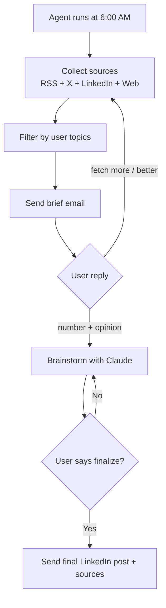

# Anjana's Content Agent

Built from the actual workflow on March 26, 2026.

**Note:** This repository is CLI-only for technical users. The web frontend has been removed.

**Build your own agent:** The repo includes [`content_agent_builder_prompt.md`](content_agent_builder_prompt.md)—a copy-paste prompt you can fill with your own likes, interests, sources, and schedule—then use with an AI to design or adapt a **custom** content agent (same patterns as this project).

**Source:** [github.com/AnjanaG/content-Agent](https://github.com/AnjanaG/content-Agent)

To push updates from your machine after cloning or editing locally:

```bash
git add -A && git commit -m "Your message" && git push origin main
```

Use GitHub CLI (`gh auth login`), SSH remote, or a [personal access token](https://github.com/settings/tokens) when `git push` asks for credentials.

---

## What it does

Every morning at 6am you get an email with 10 items:
- Latest from Anthropic, OpenAI, Cursor, Replit, Perplexity blogs
- TechCrunch AI, Wired, Ars Technica, MIT Tech Review
- Lenny Rachitsky, The Neuron, Ben's Bites, Dept of Product
- X posts from Karpathy, Sam Altman, Shreyas Doshi, Aravind Srinivas, Amjad Masad, Bret Taylor
- LinkedIn posts from top PM voices
- Podcasts: Lex Fridman, Lenny's Podcast, key AI founder interviews
- Harvey, Sierra, Decagon, WSJ via web search

You reply with a number + your raw opinion.
The agent challenges your angle, verifies all claims, sharpens the post.
When you say "finalize" — a LinkedIn-ready post lands in your inbox.
Sources included as a ready-to-paste first comment.

---

## Guardrails (learned from session)

1. **Every claim verified** — agent pushes back on anything vague or unverified
2. **Every quote verbatim** — with source URL and timestamp
3. **Source URL required** — for every company, product, or statistic mentioned
4. **Voice enforced** — direct, specific, production-credible. No buzzword soup.
5. **250 word limit** — agent cuts ruthlessly
6. **Primary sources preferred** — transcripts, official blogs, not just press coverage
7. **Credibility anchor** — TikTok: $150M, 200K advertisers, 30→85% CSAT

---

## Content Workflow Diagram



---

## Quick Start by Persona

## For Technical Users (CLI)

### Step 1 — Gmail App Password
1. myaccount.google.com → Security → 2-Step Verification → App passwords
2. Generate for Mail → copy 16-char code

### Step 2 — Enable IMAP
Gmail → Settings → Forwarding and POP/IMAP → Enable IMAP

### Step 3 — Get API keys
- Anthropic: console.anthropic.com → API Keys
- Serper (free): serper.dev (needed for X, LinkedIn, WSJ)

### Step 4 — Configure
```bash
cp .env.example .env
# Fill in your keys
```

Set this in `.env`:
```bash
DAILY_HOUR=6
```

Important: never share your real `.env` file. Share only `.env.example`.

### Step 5 — Run
```bash
.venv/bin/python -m pip install -r requirements.txt
.venv/bin/python content_agent.py
```

### Optional — Run continuously on Mac
```bash
nohup .venv/bin/python content_agent.py > /dev/null 2>&1 &
```

---

## CLI-only setup

This project is configured for technical users and CLI usage only.
Configure `.env`, edit `content_agent_config.json` directly, and run:

```bash
.venv/bin/python content_agent.py
```

---

## The email workflow

**6am — Brief arrives:**
```
📰 Your Daily Content Brief — Thursday, March 26

10 items matched your topics

1. 🎙️ Lex Fridman Podcast
   Jensen Huang: NVIDIA - The $4 Trillion Company & the AI Revolution
   "I think it's now. I think we've achieved AGI..."
   → Read / Listen

2. 📄 Anthropic
   Put Claude to work on your computer
   Claude can now open apps, click, navigate...
   → Read / Listen

[...8 more...]

↩ Reply with: [number] [your raw take]
```

**You reply:**
```
1 Jensen's "two out of three" rule — I was building this manually at 
TikTok without a name for it. Agents with all three (read data, 
execute code, communicate externally) is how things go wrong at scale.
```

**Agent replies — Brainstorm Round 1:**
```
That's strong. "Jensen named the rule, you were building it" is the 
credibility line. But let me push: what specifically went wrong at 
TikTok when agents had all three? Was it a campaign that ran wrong? 
An order that got cancelled? That specific moment will land harder 
than the general principle.
```

**You:**
```
Our LLM ad agent once flagged 400 campaigns for budget reallocation 
simultaneously — the downstream communication went out before human 
review. Had to roll back.
```

**Agent:**
```
Perfect. Here's the post...
[POST START]
...
[POST END]
[SOURCES START]
→ Jensen Huang, Lex Fridman Podcast #494 (Mar 23): lexfridman.com/jensen-huang
→ "two out of three" — transcript timestamp 00:37:03
→ Anthropic Computer Use (Mar 24): support.claude.com/en/articles/computer-use
[SOURCES END]
```

**You:** `finalize`

**Final post lands in inbox — copy paste to LinkedIn.**

---

## Run permanently on Mac

```bash
nohup python content_agent.py > /dev/null 2>&1 &
echo $! > agent.pid

# Stop it:
kill $(cat agent.pid)
```

As long as this process is running, the agent will run automatically every day at 6:00 AM.

## Deploy free on Railway

1. Push this folder to GitHub
2. railway.app → New Project → Deploy from GitHub
3. Add .env variables in Railway dashboard
4. Done — runs 24/7

---

## Customize sources

Edit sources in `content_agent_config.json`
or modify the defaults in `content_agent.py` under `load_config()`.

Add any RSS feed, X account, or web search query.
